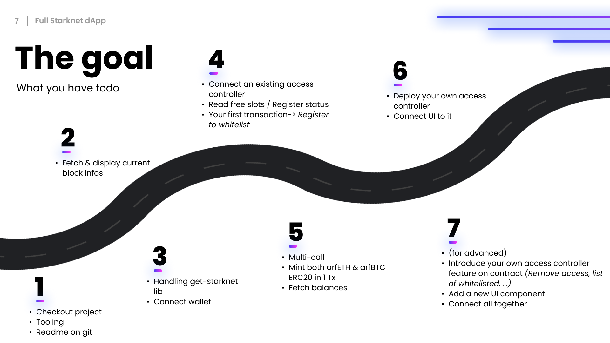

# NextJS - Starknet.js - Cairo • Workshop

**StarknetCC** - Full dApp workshop by Alpha Road team

You'll find the PDF presentation [here](./files/presentation.pdf)

## Introduction

This workshop will show you how to dev a full Starknet dApp with NextJS & [Starknet.js](https://github.com/seanjameshan/starknet.js), including multi-wallets support([Argent-x](https://github.com/argentlabs/argent-x) | [Braavos](https://braavos.app/)) and multi-call transactions.

This repo contains the front-end part, you'll find the contracts part [here (access controller)](https://github.com/419Labs/access-controller-contracts)

You'll also use an ERC20 contract, with a 'freeMint' function added allowing you to mint up to 1k tokens per call(see [ABI](src/contracts/abis/ARF_ERC20.json)).

This workshop currently run on the **Starknet Goerli Testnet**

## Use case

Explore the contract interactions in NextJS by using an access controller contract (whitelist) & ERC20 contracts deployed on Starknet.

- Contract interactions
   - Start with existing contracts
   - Deploy & connect your own
- Access controller
   - freeSlotsCount
   - isAllowed
   - register
- Minting tokens (multicalls)


## The Goal



## Prerequisite

To follow this workshop you should at least:
- Have a Starknet compatible wallet installed (with some Starknet Goerli ETH in wallet to do TX's)
- Have basic knowledge in ReactJS / NextJS framework
- Have basic knowledge in Cairo smart contracts development
- Have basic knowledge on how Starknet works(BC in general, Account abstraction, ...)

About the tooling:
- IDE
- Yarn or NPM
- [Nile](https://github.com/OpenZeppelin/nile) (smart contracts part)

Clone the repository

```bash
git clone git@github.com:419Labs/workshop-arf-dapp.git
cd workshop-arf-dapp
```

Install Dependencies

```bash
yarn | npm install 
```

Run in dev

```bash
yarn dev | npm run dev
```

## File tree

Here are the interesting files tree you'll have to update/use during this workshop

- __src__
   - __components__
      - __wallet__
         - Block.tsx
         - MultiMint.tsx
         - RegisterWhitelist.tsx
         - Transactions.tsx
         - WalletConnect.tsx
   - __pages__
      - _app.tsx
      - index.tsx
   - __context__
      - __BlockProvider__
      - __ContractProvider__
      - __StarknetProvider__
      - __TransactionsProvider__
   - __contracts__
      - __abis__
         - ARF_ERC20.json
         - AccessController.json
      - addresses.ts

## TODO

1) Familiarize a little with the project
   1) See the file tree
   2) Contract addresses are located in [contract constants](src/contracts/addresses.ts)
   3) Use of [React Context](https://fr.reactjs.org/docs/hooks-reference.html#usecontext) to isolate code complexity
   4) (use of [ChakraUI](https://chakra-ui.com/getting-started) components library)
2) Fetching block infos
   1) Update the [StarknetProvider](src/context/StarknetProvider/manager.ts) to connect to the default Starknet provider by using [Starknet.js](https://github.com/seanjameshan/starknet.js)
   2) Update the [BlockProvider](src/context/BlockProvider/provider.tsx), use the current provider to fetch current block infos
   3) (The UI part is already done here)
3) Wallet connect
   1) Look at the [WalletConnect button component](src/components/wallet/WalletConnect.tsx)
   2) Update the "connectBrowserWallet" [StarknetProvider](src/context/StarknetProvider/manager.ts) to ask user wallet connection by using [get-starknet library](https://github.com/starknet-community-libs/get-starknet)
      1) Update the default provider by the user provider
   3) You should be able to connect with Braavos or ArgentX, and see your current address on the UI
4) Your first transaction
   1) Start by taking a look at the [Contract Provider model](src/context/ContractProvider/model.ts)
   2) You can now update the [RegisterWhitelist component](src/components/wallet/RegisterWhitelist.tsx) to
      1) Fetch the total free slots currently available
      2) Fetch the current whitelisted status of the connected account
      3) Register to the whitelist if there is free slots & the connected account is not currently whitelisted
5) Multi-call
   1) Look at the [MultiMint component](src/components/wallet/MultiMint.tsx)
   2) Here you'll have to
      1) Fetch balances of arfBTC & arfETH when needed
      2) Mint both arfBTC & arfETH in 1 TX using the multicall
   3) (You can also make a 'register to whitelist + mint token' in 1 TX as well)
6) Deploy your own Access Controller
   1) You can put aside IDE for the time & open your terminal
   2) clone the [access-controller](https://github.com/419Labs/access-controller-contracts) repo
      1) ``> git clone git@github.com:419Labs/access-controller-contracts.git``
   3) Use nile to compile & deploy the contracts
      1) ``> nile compile``
      2) ``> nile deploy AccessController --alias my_access_controller [...args] --network=goerli``
      3) Wait until the contract is deployed
         1) You can check the status of the TX by calling [get_transaction](https://docs.starknet.io/docs/CLI/commands#starknet-get_transaction) on the starknet cli
   4) Once it's ok, you can test it by calling *freeSlotsCount* on the deployed contract
      1) With Nile CLI
      2) With the [voyager](https://goerli.voyager.online/)
   5) You can now replace the ACCESS_CONTROLLER_CONTRACT_ADDRESS in [the contract constants](src/contracts/addresses.ts) to use your own
7) Add your feature
   1) In this part you'll add your own feature from A to Z
   2) Start by choosing the feature you want to implement
      1) Remove from whitelist, Get a list of all whitelisted addresses, ...
   3) Implement the feature on the [AccessController_base contract](https://github.com/419Labs/access-controller-contracts/blob/main/contracts/libraries/AccessController_base.cairo) & Add the corresponding @view or @external interface on the [AccessController contract](https://github.com/419Labs/access-controller-contracts/blob/main/contracts/AccessController.cairo)
   4) Compile & Deploy your new contract
      1) Get the new abi.json & update the [current one](src/contracts/abis/AccessController.json)
   5) Implement the new feature on the UI
      1) By create a new component in */src/components/wallet* & add it in the [index](src/pages/index.tsx)

## Contract addresses

#### Access Controller
    0x027b91a18ed8c3ea77617c1818fb43ab0397144b956506181bf88ab9885a1338

#### arfETH ERC20
    0x3dd7b0db7cca8e8468d06d27b40ca9368754c30d76900fcd19a65736fab9084
    name: Ethereum Goerli
    symbol: arfETH
    supply: Infinite

#### arfBTC ERC20
    0x72df4dc5b6c4df72e4288857317caf2ce9da166ab8719ab8306516a2fddfff7
    name: Bitcoin Goerli
    symbol: arfBTC
    supply: Infinite

## Go further

There some improvements you can make to improve this workshop, here is a non-exhaustive list:

- Save transactions in local storage
- Display current transaction information on the UI (toast, history panel, ...)
- Auto reload of: whitelisted after register, balance after mint
- Implement a button to be able to add a specific token to your wallet
- ...

## Docs

Here is all the docs you'll need to complete the workshop

https://www.starknetjs.com/

https://github.com/starknet-community-libs/get-starknet

https://github.com/OpenZeppelin/nile

https://github.com/OpenZeppelin/cairo-contracts

## Helps

Work with **big numbers** in JavaScript could be a mess.
As you'll probably use the 18 decimals standard for the token balances, you'll not be able to store it as a Number but as a string representation.
To abstract the complexity, you can use the well known [Ether.js library](https://docs.ethers.io/v5/getting-started/) (especially the formatUnits & parseUnits)
in completion of the [Starknet.js](https://www.starknetjs.com/docs/API/utils#number) helpers(toFelt, bnToUint256, ...)


## Thanks

Forked from [Cairopal](https://github.com/abigger87/cairopal)

## License

This workshop is released under the [AGPL-3.0-only](LICENSE).